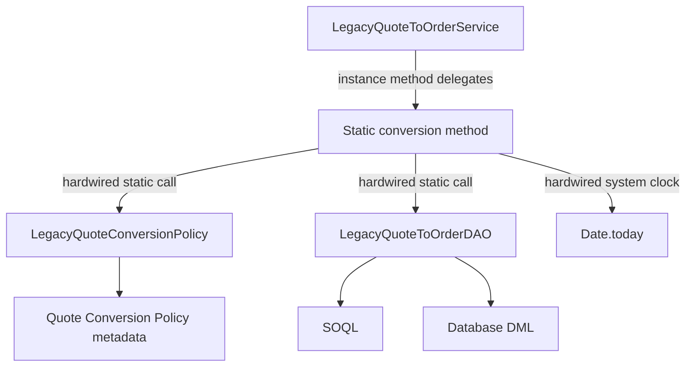
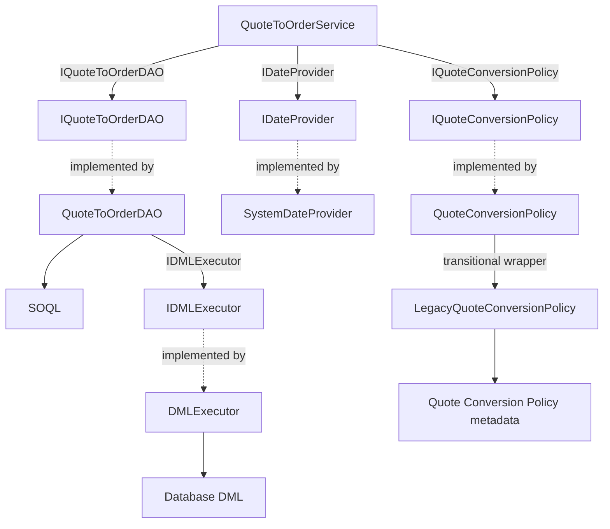

# Testable Apex brown-bag demo

This Salesforce DX project contrasts a tightly coupled Quote-to-Order implementation with an interface-driven, constructor-injected service tested using Apex Mockery. Its measured results demonstrate the practical payoff: isolated business-unit tests provide substantially faster feedback, while a focused integration suite proves that the complete Salesforce data flow still works.

## Architecture

The diagrams begin at the two services and focus on how each implementation obtains the dependencies needed to convert Quotes. Both implementations are bulkified, return the same result type, and skip Quotes whose status is not eligible.

### Legacy implementation: dependencies are hardwired



The interface around `LegacyQuoteToOrderService` is a transitional adapter: it lets the trigger and handler treat both implementations uniformly, but it deliberately does not change the legacy internals. Static policy access, data access, DML, and the system clock remain tightly coupled and therefore require data-heavy tests.

### Refactored implementation: dependencies are supplied explicitly



`QuoteTriggerDependencies` is the production composition root: it creates the concrete DAO, clock, and policy implementations and supplies them to the service. Business rules and record mapping stay in `QuoteToOrderService`; persistence orchestration stays in `QuoteToOrderDAO`; actual writes pass through the reusable `IDMLExecutor`. Tests can replace each interface independently. `QuoteConversionPolicy` also shows incremental migration by wrapping the existing static policy lookup instead of requiring every legacy dependency to be redesigned at once.

### Coexistence during migration

The trigger-side components sit outside the service comparison. `QuoteTrigger` reads the feature flag, obtains either service from `QuoteTriggerDependencies`, and injects the selected `IQuoteToOrderService` into `QuoteTriggerHandler`. This wiring demonstrates how a tightly coupled implementation and a refactored implementation can coexist behind one contract while callers migrate incrementally. It does not change the internal architecture shown in either service diagram.

All production classes use `inherited sharing`: callers determine record-sharing behavior, while the permission set grants explicit CRUD/FLS for manual demonstration. This sample is intentionally not a production-grade security framework.

## Quote-to-Order process

Conversion starts when an existing Quote is updated and its status changes. The trigger delegates the changed Quote to the selected service, which compares the Quote status with `Accepted_Quote_Status__c` from the `Quote_Conversion_Policy.Default` Custom Metadata record. The Opportunity stage does not control eligibility in this example; the default accepted Quote status is `Accepted`.

For an eligible Quote, the service loads its Quote Lines, validates the source data, creates one draft Order, creates an Order Item for every Quote Line, and stores the new Order ID in `Quote.Converted_Order__c`. The conversion is bulkified, so one trigger invocation can process multiple Quotes.

A realistic Quote test requires more than the Quote itself. Salesforce requires the surrounding sales data graph:

```text
Account
  └─ Opportunity
       └─ Quote
            └─ Quote Line Items

Price Book
  └─ Price Book Entries
       ├─ Quote Line Items
       └─ Order Items
```

The Account supplies the future `Order.AccountId`, while the Opportunity is the required parent used to create the Quote. The Quote and Opportunity use the same Price Book, and each Quote Line references an active Price Book Entry. This is why the integration and E2E tests must create Accounts, Opportunities, Products, Price Book Entries, Quotes, and Quote Lines before they can verify Order creation.

The positive scenario changes a complete Quote from another status to the configured accepted status. It verifies that the trigger creates the Order and all Order Items and links the Order back to the Quote. Negative scenarios verify that no Order is created when the Quote moves to a non-eligible status, and that conversion is rejected when an eligible Quote was already converted or is missing its Account, Price Book, or Quote Lines. Unit tests also simulate a persistence exception and verify that the Quote is not marked converted and that the trigger reports a record-level error.

## Prerequisites and preflight

- Salesforce CLI and an authenticated target org.
- Standard Quotes enabled at Setup → Quote Settings. Keep “Create Quotes Without a Related Opportunity” disabled.
- Standard Orders enabled at Setup → Order Settings.
- Apex Mockery pinned to installed package version **2.3.0.1** (package version ID `04tDn0000011O0VIAU`, API 61.0).

If Quote/QuoteLineItem is absent, enable Quotes; if Order/OrderItem is absent, enable Orders. Feature enablement is an org-level Setup action, separate from deployment. Never create custom substitutes.

```powershell
.\scripts\preflight.ps1 <ORG_ALIAS>
```

```bash
./scripts/preflight.sh <ORG_ALIAS>
```

The default Custom Metadata record accepts Quote status `Accepted` and sets `Use_Legacy_Implementation__c` to `false`. The policy API returns the complete record so callers can retrieve both values with one lookup. Change `force-app/main/default/customMetadata/Quote_Conversion_Policy.Default.md-meta.xml` if preflight reports a different active business status.

Apex Stub API mocks cannot cross a managed-package namespace boundary. This verified org and Apex Mockery install are both unnamespaced, so the limitation does not apply; revisit the packaging strategy in a namespaced org.

## Deploy and test

```powershell
.\scripts\deploy.ps1 <ORG_ALIAS>
.\scripts\assign-permission-set.ps1 <ORG_ALIAS>
.\scripts\run-demo-tests.ps1 <ORG_ALIAS>
.\scripts\benchmark-tests.ps1 <ORG_ALIAS>
```

Bash equivalents with the same filenames are also provided. Manual commands:

```text
sf project deploy start --target-org <ORG_ALIAS> --source-dir force-app/main/default --test-level RunSpecifiedTests --tests LegacyQuoteToOrderServiceTest --tests QuoteToOrderServiceTest --tests QuoteToOrderDAOTest --tests DMLExecutorTest --tests LegacyQuoteConversionPolicyTest --tests QuoteConversionPolicyTest --tests QuoteTriggerDependenciesTest --tests QuoteTriggerHandlerTest --tests QuoteTriggerTest --tests QuoteToOrderExceptionTest --tests QuoteToOrderResultTest --tests SystemDateProviderTest --tests TestUtilityTest --wait 30
sf org assign permset --name Quote_Conversion --target-org <ORG_ALIAS>
sf apex run test --target-org <ORG_ALIAS> --tests LegacyQuoteToOrderServiceTest --tests QuoteToOrderServiceTest --tests QuoteToOrderDAOTest --tests DMLExecutorTest --tests LegacyQuoteConversionPolicyTest --tests QuoteConversionPolicyTest --tests QuoteTriggerDependenciesTest --tests QuoteTriggerHandlerTest --tests QuoteTriggerTest --tests QuoteToOrderExceptionTest --tests QuoteToOrderResultTest --tests SystemDateProviderTest --tests TestUtilityTest --wait 30 --result-format human --code-coverage
```

The complete test command runs all 13 repository test classes. The implementation benchmarks require multi-class runs and wall-clock measurement, so use `benchmark-tests.ps1` or `benchmark-tests.sh` instead of adding `--synchronous` to the manual command. Optionally run `sf org open --target-org <ORG_ALIAS>` when preparing the interactive demonstration.

## Class and test map

Refactored-path tests use a method-oriented convention: each production method, including private methods exercised through public behavior, has a dedicated `<methodName>Test` method. One test covers all overloads sharing the same production method name.

- `LegacyQuoteToOrderService` / `LegacyQuoteToOrderDAO` / `LegacyQuoteToOrderServiceTest`: bulk-safe static coupling through set-based query/DML wrappers and complete persisted data graphs.
- `QuoteToOrderService` / `QuoteToOrderServiceTest`: injected business logic with method-oriented Mockery tests and no SOQL/DML.
- `QuoteToOrderDAO` / `QuoteToOrderDAOTest`: combined, bulk persistence behavior with mapping tested independently through a mocked `IDMLExecutor`.
- `DMLExecutor`: a reusable, object-agnostic wrapper around bulk insert, upsert, update, delete, and undelete `Database` calls, including `allOrNone`, external-ID, and access-level parameters.
- `QuoteTriggerDependencies`: production composition root for the policy and both service implementations.
- `LegacyQuoteConversionPolicy`: static access to the complete `Default` Custom Metadata policy record, used directly by the legacy service.
- `QuoteConversionPolicy`: injectable adapter that delegates the complete policy lookup to `LegacyQuoteConversionPolicy` through `IQuoteConversionPolicy`.
- `QuoteTrigger` / `QuoteTriggerTest`: positive and negative end-to-end conversion tests using the real metadata-controlled implementation selection.
- `QuoteTriggerHandler` / `QuoteTriggerHandlerTest`: context routing and transition filtering tested with one mocked service abstraction.

### E2E tests as a migration safety net

Keep the existing E2E tests while transitioning from the legacy implementation, even when the suite contains many slow scenarios. Those tests capture established business behavior across triggers, configuration, queries, mapping, and persistence. Running the same assertions against both metadata-selected implementations provides strong evidence that the refactor preserves behavior instead of merely achieving line coverage.

The target test pyramid can be adopted gradually. Once behavioral parity is established and every business rule, validation branch, mapping decision, and failure path is covered by fast isolated tests, redundant E2E scenarios can be removed. A small set of critical positive and negative journeys should remain permanently to verify that production composition and Salesforce integration still work together. This approach avoids deleting the old safety net before the new test seams have earned equivalent confidence.

## Benchmark results

Before timing, the implementation-specific production classes were verified at 100% line coverage on both paths. Every production method is exercised. The legacy DAO is covered through the data-heavy service tests because its static coupling provides no useful isolated test seam. The refactored DAO verifies query execution through governor limits and verifies persistence mapping through a mocked `IDMLExecutor`.

The benchmark excludes `QuoteTriggerTest`, the reusable `DMLExecutorTest`, and shared trigger/result/utility tests that cannot be attributed uniquely to either implementation. The measured suites are:

- Legacy: `LegacyQuoteToOrderServiceTest` and `LegacyQuoteConversionPolicyTest`—2 classes and 12 test methods.
- Refactored: `QuoteToOrderServiceTest`, `QuoteToOrderDAOTest`, `SystemDateProviderTest`, and `QuoteConversionPolicyTest`—4 classes and 12 test methods.

Each suite ran once for warm-up followed by five measured runs. The runs within each sample were submitted and completed sequentially. Both samples use the current suite definitions, including the refactored `convertExceptionTest`. Salesforce execution time is the platform-reported Apex test duration; wall time additionally includes CLI startup, network latency, queueing, and result processing.

| Suite      | Salesforce median | Salesforce range | Wall median |      Wall range |
| ---------- | ----------------: | ---------------: | ----------: | --------------: |
| Legacy     |          2,331 ms |   1,296–2,779 ms |    9,513 ms |  6,498–9,535 ms |
| Refactored |            306 ms |       102–492 ms |    5,490 ms | 3,459–10,506 ms |

In these measurements, the refactored suite used 86.9% less Salesforce execution time and had a 7.6× lower median. Its median wall time was 42.3% lower. Results vary with org load and automation; the measured advantage demonstrates the feedback-speed benefit of isolated tests rather than promising an identical ratio in every org.

The legacy timing includes the one shared `@TestSetup` execution, but its method count reports only the 12 actual test methods. The current results are preserved in the [legacy summary](benchmark-results/legacy-20260816-213442/summary.md), [legacy CSV](benchmark-results/legacy-20260816-213442/summary.csv), [legacy raw JSON](benchmark-results/legacy-20260816-213442/raw/), [refactored summary](benchmark-results/refactored-20260816-213544/summary.md), [refactored CSV](benchmark-results/refactored-20260816-213544/summary.csv), and [refactored raw JSON](benchmark-results/refactored-20260816-213544/raw/).

Run `benchmark-tests.ps1` or `benchmark-tests.sh` to execute both current suites. Use `benchmark-legacy` or `benchmark-refactored` with the matching script extension to measure one side independently. Each runner creates a timestamped result directory instead of overwriting prior evidence.

### DML executor infrastructure timing

`DMLExecutorTest` verifies the generic `Database` wrapper across insert, update, upsert, delete, and undelete operations. It is reusable infrastructure rather than a test suite that grows with each service, so its runtime is measured separately and does not count toward either service-suite result above.

After one warm-up, five measured synchronous runs produced:

| Run | Salesforce execution | Wall time |
| --: | -------------------: | --------: |
|   1 |             1,411 ms |  3,474 ms |
|   2 |               977 ms |  3,464 ms |
|   3 |             1,814 ms |  4,492 ms |
|   4 |             1,307 ms |  3,472 ms |
|   5 |               937 ms |  3,472 ms |

The Salesforce median was **1,307 ms** with a **937–1,814 ms** range. Median wall time was **3,472 ms** with a **3,464–4,492 ms** range. These measurements describe the one-time regression cost of the shared DML abstraction; they are not added to the refactored service timing.

The saved [DML executor summary](benchmark-results/dml-executor-20260816-201011/summary.md), [CSV measurements](benchmark-results/dml-executor-20260816-201011/summary.csv), and [raw CLI JSON](benchmark-results/dml-executor-20260816-201011/raw/) preserve the infrastructure benchmark.

### Legacy end-to-end timing

For this measurement, `Use_Legacy_Implementation__c` was manually enabled in the org. `QuoteTriggerTest` used the actual Custom Metadata record and production dependencies; it did not mock or override the policy, trigger handler, legacy service, DAO, or DML. The two methods cover successful Quote conversion and rejection of a non-eligible status.

After one warm-up, five measured synchronous runs produced the following per-method results:

| Run | `quoteTriggerTest` | `nonEligibleStatusTest` | Suite Salesforce | Wall time |
| --: | -----------------: | ----------------------: | ---------------: | --------: |
|   1 |           1,092 ms |                  570 ms |         1,676 ms |  4,463 ms |
|   2 |           1,288 ms |                  730 ms |         2,043 ms |  4,500 ms |
|   3 |             584 ms |                  458 ms |         1,051 ms |  3,486 ms |
|   4 |             617 ms |                  460 ms |         1,085 ms |  3,450 ms |
|   5 |             585 ms |                  355 ms |           951 ms |  3,464 ms |

Per-method findings:

- `quoteTriggerTest`, which performs the successful Quote-to-Order conversion: median **617 ms**, range **584–1,288 ms**.
- `nonEligibleStatusTest`, which verifies that an ineligible status creates no Order: median **460 ms**, range **355–730 ms**.
- Complete E2E suite: Salesforce median **1,085 ms**, range **951–2,043 ms**.
- Wall time: median **3,486 ms**, range **3,450–4,500 ms**.

This E2E timing is reported separately from the service-suite benchmark because it measures the entire trigger, metadata, query, mapping, and persistence path.

The saved [detailed legacy E2E summary](benchmark-results/e2e-legacy-detailed-20260816-201339/summary.md), [suite CSV](benchmark-results/e2e-legacy-detailed-20260816-201339/suite-summary.csv), [per-method CSV](benchmark-results/e2e-legacy-detailed-20260816-201339/method-summary.csv), and [raw CLI JSON](benchmark-results/e2e-legacy-detailed-20260816-201339/raw/) preserve the end-to-end benchmark.

### Refactored end-to-end timing

For this measurement, `Use_Legacy_Implementation__c` was manually disabled in the org. The same unmodified `QuoteTriggerTest` methods used the actual Custom Metadata record and the fully composed refactored service, DAO, DML executor, policy, and date provider.

After one warm-up, five measured synchronous runs produced:

| Run | `quoteTriggerTest` | `nonEligibleStatusTest` | Suite Salesforce | Wall time |
| --: | -----------------: | ----------------------: | ---------------: | --------: |
|   1 |           1,380 ms |                  693 ms |         2,086 ms |  4,475 ms |
|   2 |             572 ms |                  424 ms |         1,002 ms |  3,474 ms |
|   3 |           1,031 ms |                  660 ms |         1,706 ms |  4,481 ms |
|   4 |             595 ms |                  442 ms |         1,047 ms |  3,501 ms |
|   5 |           1,183 ms |                  702 ms |         1,899 ms |  7,507 ms |

Per-method findings:

- `quoteTriggerTest`: median **1,031 ms**, range **572–1,380 ms**.
- `nonEligibleStatusTest`: median **660 ms**, range **424–702 ms**.
- Complete E2E suite: Salesforce median **1,706 ms**, range **1,002–2,086 ms**.
- Wall time: median **4,475 ms**, range **3,474–7,507 ms**.

The saved [detailed refactored E2E summary](benchmark-results/e2e-refactored-detailed-20260816-201637/summary.md), [suite CSV](benchmark-results/e2e-refactored-detailed-20260816-201637/suite-summary.csv), [per-method CSV](benchmark-results/e2e-refactored-detailed-20260816-201637/method-summary.csv), and [raw CLI JSON](benchmark-results/e2e-refactored-detailed-20260816-201637/raw/) preserve the refactored end-to-end benchmark.

### End-to-end comparison

| Measurement             | Legacy median | Refactored median |
| ----------------------- | ------------: | ----------------: |
| `quoteTriggerTest`      |        617 ms |          1,031 ms |
| `nonEligibleStatusTest` |        460 ms |            660 ms |
| Complete Salesforce run |      1,085 ms |          1,706 ms |
| Wall time               |      3,486 ms |          4,475 ms |

In these five-run samples, the refactored E2E median was higher. The ranges overlap substantially, and both paths perform the same real setup, SOQL, Order/OrderItem DML, Quote update, and trigger execution. This comparison validates equivalent production behavior; it does not isolate the unit-test speed benefit measured in the implementation benchmark above.

### Reproducing the E2E measurement

Set `Use_Legacy_Implementation__c` on the org's `Quote_Conversion_Policy.Default` Custom Metadata record to the implementation being measured. `QuoteTriggerTest` reads the real record, so no test-code change is required. Run one unmeasured warm-up, then five measured runs. Keep the runs sequential and do not enable parallel execution.

Single run, including the per-method runtime breakdown:

```text
sf apex run test --target-org <ORG_ALIAS> --tests QuoteTriggerTest --synchronous --result-format human --code-coverage
```

PowerShell warm-up and five measured JSON runs:

```powershell
sf apex run test --target-org <ORG_ALIAS> --tests QuoteTriggerTest --synchronous --result-format json | Out-Null

1..5 | ForEach-Object {
    sf apex run test --target-org <ORG_ALIAS> --tests QuoteTriggerTest --synchronous --result-format json |
        Set-Content -Encoding utf8 "quote-trigger-run-$_.json"
}
```

Bash warm-up and five measured JSON runs:

```bash
sf apex run test --target-org <ORG_ALIAS> --tests QuoteTriggerTest --synchronous --result-format json >/dev/null

for run in 1 2 3 4 5; do
  sf apex run test --target-org <ORG_ALIAS> --tests QuoteTriggerTest --synchronous --result-format json \
    >"quote-trigger-run-${run}.json"
done
```

In each JSON file, use `result.tests[].MethodName` and `result.tests[].RunTime` for the per-method measurements and `result.summary.testExecutionTime` for the complete Salesforce test execution time. Measure the CLI process externally when wall-clock time is also required.
