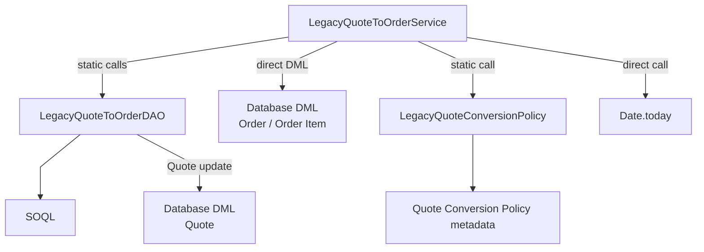
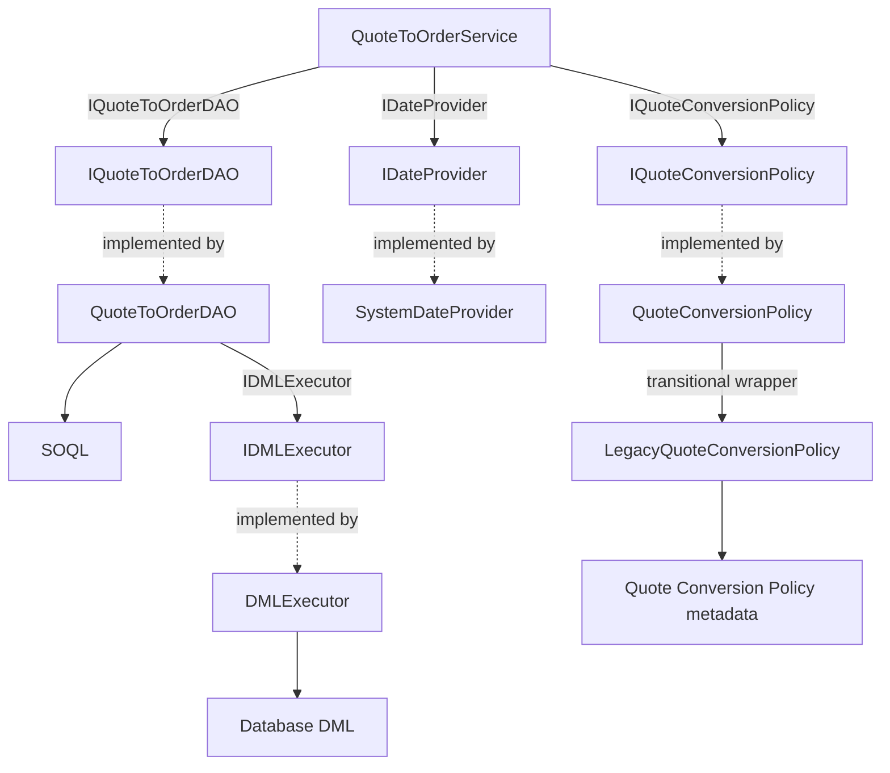

# Testable Apex brown-bag demo

This Salesforce DX project contrasts a tightly coupled Quote-to-Order implementation with an interface-driven, constructor-injected service tested using Apex Mockery. Its measured results demonstrate the practical payoff: isolated business-unit tests provide substantially faster feedback, while a focused integration suite proves that the complete Salesforce data flow still works.

## Quote-to-Order process

Conversion starts when an existing Quote is updated and its status changes. The trigger delegates the changed Quote to the selected service, which compares the Quote status with `Accepted_Quote_Status__c` from the `Quote_Conversion_Policy.Default` Custom Metadata record. The Opportunity stage does not control eligibility in this example; the default accepted Quote status is `Accepted`.

For an eligible Quote, the service loads its Quote Lines, validates the source data, creates one draft Order, creates an Order Item for every Quote Line, and stores the new Order ID in `Quote.Converted_Order__c`. The conversion is bulkified, so one trigger invocation can process multiple Quotes.

A realistic Quote test requires more than the Quote itself. Salesforce requires the surrounding sales data graph:

```text
Account
  └─ Opportunity
       └─ Quote
            └─ Quote Line Items

Price Book
  └─ Price Book Entries
       ├─ Quote Line Items
       └─ Order Items
```

The Account supplies the future `Order.AccountId`, while the Opportunity is the required parent used to create the Quote. The Quote and Opportunity use the same Price Book, and each Quote Line references an active Price Book Entry. This is why the integration and E2E tests must create Accounts, Opportunities, Products, Price Book Entries, Quotes, and Quote Lines before they can verify Order creation.

The positive scenario changes a complete Quote from another status to the configured accepted status. It verifies that the trigger creates the Order and all Order Items and links the Order back to the Quote. Negative scenarios verify that no Order is created when the Quote moves to a non-eligible status, and that conversion is rejected when an eligible Quote was already converted or is missing its Account, Price Book, or Quote Lines. Unit tests also simulate a persistence exception and verify that the Quote is not marked converted and that the trigger reports a record-level error.

## Architecture

The diagrams compare how the legacy and refactored services access the dependencies required to convert Quotes. Both implementations are bulkified, return the same result type, and skip Quotes whose status is not eligible.

### Legacy implementation: dependencies are hardwired



The public instance method delegates to the service's existing static conversion method; that internal detail is omitted from the diagram so the dependency structure remains clear. The interface around `LegacyQuoteToOrderService` is a transitional adapter: it lets the trigger and handler treat both implementations uniformly, but it deliberately does not change the legacy internals. Static policy access, data access, DML, and the system clock remain tightly coupled and therefore require data-heavy tests.

### Refactored implementation: dependencies are supplied explicitly



`QuoteTriggerDependencies` is the production composition root: it creates the concrete DAO, clock, and policy implementations and supplies them to the service. Business rules and record mapping stay in `QuoteToOrderService`; persistence orchestration stays in `QuoteToOrderDAO`; actual writes pass through the reusable `IDMLExecutor`. Tests can replace each interface independently. `QuoteConversionPolicy` also shows incremental migration by wrapping the existing static policy lookup instead of requiring every legacy dependency to be redesigned at once.

### Coexistence during migration

The trigger-side components sit outside the service comparison. `QuoteTrigger` reads the feature flag, obtains either service from `QuoteTriggerDependencies`, and injects the selected `IQuoteToOrderService` into `QuoteTriggerHandler`. This wiring demonstrates how a tightly coupled implementation and a refactored implementation can coexist behind one contract while callers migrate incrementally. It does not change the internal architecture shown in either service diagram.

All production classes use `inherited sharing`: callers determine record-sharing behavior, while the permission set grants explicit CRUD/FLS for manual demonstration. This sample is intentionally not a production-grade security framework.

## Prerequisites and preflight

- Salesforce CLI and an authenticated target org.
- Standard Quotes enabled at Setup → Quote Settings. Keep “Create Quotes Without a Related Opportunity” disabled.
- Standard Orders enabled at Setup → Order Settings.
- Apex Mockery pinned to installed package version **2.3.0.1** (package version ID `04tDn0000011O0VIAU`, API 61.0).

If Quote/QuoteLineItem is absent, enable Quotes; if Order/OrderItem is absent, enable Orders. Feature enablement is an org-level Setup action, separate from deployment. Never create custom substitutes.

```powershell
.\scripts\preflight.ps1 <ORG_ALIAS>
```

```bash
./scripts/preflight.sh <ORG_ALIAS>
```

The default Custom Metadata record accepts Quote status `Accepted` and sets `Use_Legacy_Implementation__c` to `false`. The policy API returns the complete record so callers can retrieve both values with one lookup. Change `force-app/main/default/customMetadata/Quote_Conversion_Policy.Default.md-meta.xml` if preflight reports a different active business status.

Apex Stub API mocks cannot cross a managed-package namespace boundary. This verified org and Apex Mockery install are both unnamespaced, so the limitation does not apply; revisit the packaging strategy in a namespaced org.

## Deploy and test

```powershell
.\scripts\deploy.ps1 <ORG_ALIAS>
.\scripts\assign-permission-set.ps1 <ORG_ALIAS>
.\scripts\run-demo-tests.ps1 <ORG_ALIAS>
.\scripts\benchmark-tests.ps1 <ORG_ALIAS>
```

Bash equivalents with the same filenames are also provided. Manual commands:

```text
sf project deploy start --target-org <ORG_ALIAS> --source-dir force-app/main/default --test-level RunSpecifiedTests --tests LegacyQuoteToOrderServiceTest --tests QuoteToOrderServiceTest --tests QuoteToOrderDAOTest --tests DMLExecutorTest --tests LegacyQuoteConversionPolicyTest --tests QuoteConversionPolicyTest --tests QuoteTriggerDependenciesTest --tests QuoteTriggerHandlerTest --tests QuoteTriggerTest --tests QuoteToOrderExceptionTest --tests QuoteToOrderResultTest --tests SystemDateProviderTest --tests TestUtilityTest --wait 30
sf org assign permset --name Quote_Conversion --target-org <ORG_ALIAS>
sf apex run test --target-org <ORG_ALIAS> --tests LegacyQuoteToOrderServiceTest --tests QuoteToOrderServiceTest --tests QuoteToOrderDAOTest --tests DMLExecutorTest --tests LegacyQuoteConversionPolicyTest --tests QuoteConversionPolicyTest --tests QuoteTriggerDependenciesTest --tests QuoteTriggerHandlerTest --tests QuoteTriggerTest --tests QuoteToOrderExceptionTest --tests QuoteToOrderResultTest --tests SystemDateProviderTest --tests TestUtilityTest --wait 30 --result-format human --code-coverage
```

The complete test command runs all 13 repository test classes. The implementation benchmarks require multi-class runs and wall-clock measurement, so use `benchmark-tests.ps1` or `benchmark-tests.sh` instead of adding `--synchronous` to the manual command. Optionally run `sf org open --target-org <ORG_ALIAS>` when preparing the interactive demonstration.

## Class and test map

All unit-test classes use a method-oriented convention: each production method, including `@TestVisible` private methods, has exactly one dedicated `<methodName>Test` method. `constructorTest` is the naming exception. One test covers all overloads and all meaningful scenarios or branches for its production method; inline scenario comments keep those branches readable without multiplying test methods.

- `LegacyQuoteToOrderService` / `LegacyQuoteToOrderDAO` / `LegacyQuoteToOrderServiceTest`: bulk-safe static query coupling, direct service DML for straightforward inserts, DAO-mapped Quote updates, and complete persisted data graphs.
- `QuoteToOrderService` / `QuoteToOrderServiceTest`: injected business logic with method-oriented Mockery tests and no SOQL/DML.
- `QuoteToOrderDAO` / `QuoteToOrderDAOTest`: combined, bulk persistence behavior with mapping tested independently through a mocked `IDMLExecutor`.
- `DMLExecutor`: a reusable, object-agnostic wrapper around bulk insert, upsert, update, delete, and undelete `Database` calls, including `allOrNone`, external-ID, and access-level parameters.
- `QuoteTriggerDependencies`: production composition root for the policy and both service implementations.
- `LegacyQuoteConversionPolicy`: static access to the complete `Default` Custom Metadata policy record, used directly by the legacy service.
- `QuoteConversionPolicy`: injectable adapter that delegates the complete policy lookup to `LegacyQuoteConversionPolicy` through `IQuoteConversionPolicy`.
- `QuoteTrigger` / `QuoteTriggerTest`: positive and negative end-to-end conversion tests using the real metadata-controlled implementation selection.
- `QuoteTriggerHandler` / `QuoteTriggerHandlerTest`: context routing and transition filtering tested with one mocked service abstraction.

### E2E tests as a migration safety net

Keep the existing E2E tests while transitioning from the legacy implementation, even when the suite contains many slow scenarios. Those tests capture established business behavior across triggers, configuration, queries, mapping, and persistence. Running the same assertions against both metadata-selected implementations provides strong evidence that the refactor preserves behavior instead of merely achieving line coverage.

The target test pyramid can be adopted gradually. Once behavioral parity is established and every business rule, validation branch, mapping decision, and failure path is covered by fast isolated tests, redundant E2E scenarios can be removed. A small set of critical positive and negative journeys should remain permanently to verify that production composition and Salesforce integration still work together. This approach avoids deleting the old safety net before the new test seams have earned equivalent confidence.

## Benchmark results

Before timing, the implementation-specific production classes were verified at 100% line coverage on both paths. Every production method is exercised. The legacy DAO is covered through the data-heavy service tests because its static coupling provides no useful isolated test seam. The refactored DAO verifies query execution through governor limits and verifies persistence mapping through a mocked `IDMLExecutor`.

The benchmark excludes `QuoteTriggerTest`, the reusable `DMLExecutorTest`, and shared trigger/result/utility tests that cannot be attributed uniquely to either implementation. The measured suites are:

- Legacy: `LegacyQuoteToOrderServiceTest` and `LegacyQuoteConversionPolicyTest`.
- Refactored: `QuoteToOrderServiceTest`, `QuoteToOrderDAOTest`, `SystemDateProviderTest`, and `QuoteConversionPolicyTest`.

Each suite used one warm-up followed by five measured runs, submitted and completed sequentially. Salesforce execution time is the platform-reported Apex test duration; wall time additionally includes CLI startup, network latency, queueing, and result processing.

| Suite      | Test methods | `@TestSetup` executions | Salesforce `testsRan` | Salesforce median | Salesforce range | Wall median |      Wall range |
| ---------- | -----------: | ----------------------: | --------------------: | ----------------: | ---------------: | ----------: | --------------: |
| Legacy     |            9 |                       1 |                    10 |          1,396 ms |     964–1,568 ms |    7,508 ms | 5,494–11,524 ms |
| Refactored |           16 |                       0 |                    16 |            213 ms |       102–322 ms |    3,481 ms | 3,466–10,563 ms |

The legacy suite contains **9 test methods** across 2 classes, plus one `@TestSetup` execution, so Salesforce reports `testsRan: 10`. The refactored suite contains **16 test methods** across 4 classes and no `@TestSetup`, so Salesforce reports `testsRan: 16`. Salesforce's `testExecutionTime` includes the legacy setup execution; only the displayed method count excludes it. The raw number of tests is not a measure of equivalent work: one legacy `convertTest` contains several scenarios and crosses shared setup, SOQL, metadata, and DML, while one isolated helper test may execute only an in-memory transformation. Test count is nevertheless meaningful context here because the refactored suite executes six more Salesforce-reported test units and still has the lower platform time.

In this sample, the refactored median was **84.7% lower** and **6.6× faster** in Salesforce execution time. Its wall-time median was **53.6% lower**, but wall results are noisier because CLI startup, network latency, queueing, and result processing dominate short test runs. The result demonstrates the feedback-speed benefit of isolated tests rather than promising an identical ratio in every org or run.

The current results are preserved in the [legacy summary](benchmark-results/legacy-20260816-230546/summary.md), [legacy CSV](benchmark-results/legacy-20260816-230546/summary.csv), [legacy raw JSON](benchmark-results/legacy-20260816-230546/raw/), [refactored summary](benchmark-results/refactored-20260816-230826/summary.md), [refactored CSV](benchmark-results/refactored-20260816-230826/summary.csv), and [refactored raw JSON](benchmark-results/refactored-20260816-230826/raw/).

Run `benchmark-tests.ps1` or `benchmark-tests.sh` to execute both current suites. Use `benchmark-legacy` or `benchmark-refactored` with the matching script extension to measure one side independently. Each runner creates a timestamped result directory instead of overwriting prior evidence.

### DML executor infrastructure timing

`DMLExecutorTest` verifies the generic `Database` wrapper across insert, update, upsert, delete, and undelete operations. It is reusable infrastructure rather than a test suite that grows with each service, so its runtime is measured separately and does not count toward either service-suite result above.

After one warm-up, five measured synchronous runs produced:

| Suite        | Test methods | `@TestSetup` executions | Salesforce `testsRan` | Salesforce median | Salesforce range | Wall median |     Wall range |
| ------------ | -----------: | ----------------------: | --------------------: | ----------------: | ---------------: | ----------: | -------------: |
| DML executor |            5 |                       0 |                     5 |          1,311 ms |   1,121–1,428 ms |    3,491 ms | 3,461–4,485 ms |

The suite contains **5 test methods** across 1 class, has no `@TestSetup`, and Salesforce reports `testsRan: 5`. The Salesforce median was **1,311 ms** with a **1,121–1,428 ms** range. Median wall time was **3,491 ms** with a **3,461–4,485 ms** range. These measurements describe the one-time regression cost of the shared DML abstraction; they are not added to the refactored service timing.

The saved [DML executor summary](benchmark-results/dml-executor-20260816-231440/summary.md), [CSV measurements](benchmark-results/dml-executor-20260816-231440/summary.csv), and [raw CLI JSON](benchmark-results/dml-executor-20260816-231440/raw/) preserve the infrastructure benchmark. Re-run it with `benchmark-dml-executor.ps1 <ORG_ALIAS> 5` or `benchmark-dml-executor.sh <ORG_ALIAS> 5`.

### End-to-end comparison

`QuoteTriggerTest` was measured once with `Use_Legacy_Implementation__c` enabled and once with it disabled. The test reads the real Custom Metadata record and uses the complete production dependency graph selected by the trigger; it does not mock or override the policy, trigger handler, service, DAO, clock, or DML. Its single method covers both successful Quote conversion and rejection of a non-eligible status, so the two measurements exercise identical positive and negative scenarios.

Each path received one unmeasured warm-up followed by five measured synchronous runs. This E2E timing is reported separately from the service-suite benchmark because it measures the entire trigger, metadata lookup, query, mapping, and persistence path.

| Path       | Test methods | `@TestSetup` executions | Salesforce `testsRan` | Salesforce median | Salesforce range | Wall median |     Wall range |
| ---------- | -----------: | ----------------------: | --------------------: | ----------------: | ---------------: | ----------: | -------------: |
| Legacy     |            1 |                       0 |                     1 |          1,276 ms |   1,222–2,118 ms |    3,483 ms | 3,467–5,469 ms |
| Refactored |            1 |                       0 |                     1 |          1,453 ms |   1,222–1,463 ms |    4,463 ms | 3,465–5,504 ms |

The refactored E2E median was 177 ms (13.9%) higher in Salesforce execution time and 980 ms (28.1%) higher in wall-clock time. The ranges overlap substantially, and both paths execute the same trigger, metadata lookup, setup, queries, mapping, DML, and assertions. These E2E measurements primarily verify equivalent production behavior; the implementation-specific benchmark above isolates the unit-testing speed difference.

The saved legacy [summary](benchmark-results/e2e-legacy-20260816-231943/summary.md), [CSV measurements](benchmark-results/e2e-legacy-20260816-231943/summary.csv), and [raw CLI JSON](benchmark-results/e2e-legacy-20260816-231943/raw/), together with the refactored [summary](benchmark-results/e2e-refactored-20260816-232206/summary.md), [CSV measurements](benchmark-results/e2e-refactored-20260816-232206/summary.csv), and [raw CLI JSON](benchmark-results/e2e-refactored-20260816-232206/raw/), preserve both benchmark runs.

### Reproducing the current E2E measurement

Set `Use_Legacy_Implementation__c` on the org's `Quote_Conversion_Policy.Default` Custom Metadata record to the implementation being measured. `QuoteTriggerTest` reads the real record, so no test-code change is required. Its single `quoteTriggerTest` method now contains commented eligible and ineligible scenarios, in accordance with the one-test-per-production-method convention. Run one unmeasured warm-up, then five measured runs. Keep the runs sequential and do not enable parallel execution.

Single run, including the per-method runtime breakdown:

```text
sf apex run test --target-org <ORG_ALIAS> --tests QuoteTriggerTest --synchronous --result-format human --code-coverage
```

PowerShell warm-up and five measured JSON runs:

```powershell
sf apex run test --target-org <ORG_ALIAS> --tests QuoteTriggerTest --synchronous --result-format json | Out-Null

1..5 | ForEach-Object {
    sf apex run test --target-org <ORG_ALIAS> --tests QuoteTriggerTest --synchronous --result-format json |
        Set-Content -Encoding utf8 "quote-trigger-run-$_.json"
}
```

Bash warm-up and five measured JSON runs:

```bash
sf apex run test --target-org <ORG_ALIAS> --tests QuoteTriggerTest --synchronous --result-format json >/dev/null

for run in 1 2 3 4 5; do
  sf apex run test --target-org <ORG_ALIAS> --tests QuoteTriggerTest --synchronous --result-format json \
    >"quote-trigger-run-${run}.json"
done
```

In each JSON file, use `result.tests[].MethodName` and `result.tests[].RunTime` for the per-method measurements and `result.summary.testExecutionTime` for the complete Salesforce test execution time. Measure the CLI process externally when wall-clock time is also required.
